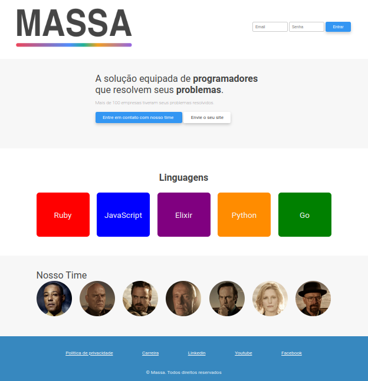

<html>
<body>
    <header>
        <h1>Meu Projeto HTML e CSS</h1>
    </header>
    

        <h2>Bem-vindo ao meu projeto</h2>
        
Este é um projeto simples criado usando HTML e CSS. Aqui estão algumas das ferramentas e técnicas que utilizei:

        <ul>
            <li>HTML para estruturar a página</li>
            <li>CSS para estilizar a página</li>
            <li>Classes para organizar e aplicar estilos aos elementos</li>
            <li>Flexbox para criar um layout flexível para os botões</li>
        </ul>
    

    
 

    <footer>
        
&copy; 2023 Meu Projeto HTML e CSS

    </footer>
</body>
</html>
